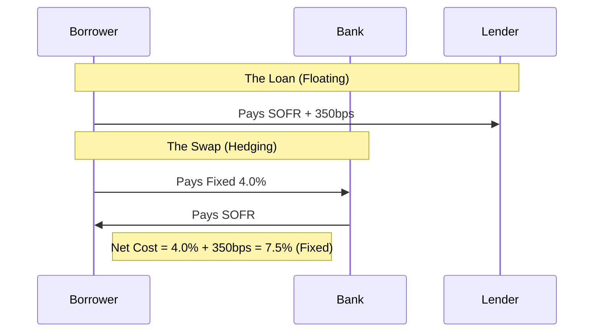

> **Buy-Side Perspective:** Derivatives are not just "weapons of mass destruction" (as Buffett said); for a credit analyst, they are vital diagnostic tools. A widening CDS spread tells you the market is panicking before the rating agencies downgrade. Additionally, understanding how your borrower uses Interest Rate Swaps (IRS) to hedge floating-rate debt is critical for assessing their true interest coverage ratio in a rising rate environment.

# Advanced Derivatives: Options, Swaps, and Risk Management

## 1. The Strategic Use of Derivatives

Credit analysts often treat derivatives as "off-balance sheet magic." You must bring them back on the balance sheet to understand the risk.

*   **Hedging:** Reducing risk (e.g., an Airline buying Call Options on Oil).
*   **Speculation:** Taking risk (e.g., selling naked Puts to collect premium).
*   **Arbitrage:** Exploiting price inefficiencies.

## 2. Options Strategies for Risk Assessment

Understanding the "Greeks" helps you assess how a borrower's hedge will perform under stress.

### Delta ($\Delta$)
The sensitivity of the option's price to the underlying asset.
*   **Relevance:** If a borrower is "Delta Hedging," they are constantly buying/selling the underlying to stay neutral. This can create liquidity spirals (Gamma Squeezes) in stressed markets.

### Gamma ($\Gamma$)
The rate of change of Delta.
*   **Relevance:** High negative gamma implies that as the market falls, the borrower must sell *more* to remain hedged, accelerating the crash.

## 3. Swaps: The Engine of Modern Finance

### Interest Rate Swaps (IRS)
Most leveraged loans are floating rate (SOFR + Margin). Borrowers use IRS to fix their cost of capital.

*   **Payer Swap:** Borrower pays Fixed, receives Floating. (Protects against rising rates).
*   **Receiver Swap:** Borrower pays Floating, receives Fixed. (Speculation on falling rates).

#### Visualizing the Cash Flow

### Credit Default Swaps (CDS)
A CDS is insurance against default.
*   **The Spread:** Quoted in basis points per year. A 500bps spread means it costs $500,000/year to insure $10M of debt.
*   **Implied Probability of Default (PD):** $PD \approx \frac{Spread}{1 - Recovery Rate}$.
    *   *Example:* If Spread = 500bps (0.05) and Recovery = 40% (0.4).
    *   $PD \approx \frac{0.05}{0.6} = 8.3\%$.

## 4. Counterparty Credit Risk (CCR)

Derivatives create bilateral risk. If the Bank in the diagram above goes bankrupt, the Borrower loses their hedge.

*   **CVA (Credit Valuation Adjustment):** The price adjustment for the risk of counterparty default.
*   **Netting Agreements:** ISDA Master Agreements allow parties to "net" their obligations (e.g., I owe you \$10M, you owe me \$8M, I pay \$2M).

<strong>Knowledge Check: The Margin Call</strong>

**Scenario:** A Hedge Fund borrower has entered into a massive "Receiver Swap" (betting rates will fall). Instead, rates rise by 200bps.

**Question:** What happens to their liquidity?

**Answer:** The Swap is now "Out of the Money" (the fixed rate they receive is lower than market). The counterparty will demand **Variation Margin** (cash collateral) immediately. If the fund doesn't have the cash, they must fire-sale assets. This is how liquidity crises start in the derivatives market (e.g., LDI Crisis in UK).

## 5. Glossary

*   **ISDA:** International Swaps and Derivatives Association. Sets the standard legal framework.
*   **Notional Amount:** The face value used to calculate payments (not the amount exchanged).
*   **Novation:** Transferring a derivative contract to a new counterparty.
