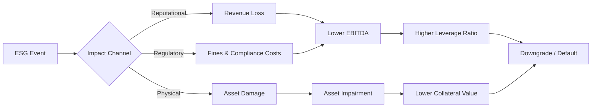

# ESG Risk Integration in Credit Analysis

> **Buy-Side Perspective:**
> ESG is not just about "doing good"; it's about avoiding default. Environmental liabilities (e.g., massive clean-up costs), Social controversies (e.g., labor strikes stopping production), and Governance failures (e.g., fraud) are direct drivers of credit risk. We integrate ESG to protect principal and properly price risk premiums.

## 1. The Materiality Map

Not all ESG factors matter for all sectors. A tech company cares about Data Privacy (Social); a mining company cares about Tailings Dam Safety (Environmental).

**SASB (Sustainability Accounting Standards Board)** is the gold standard for determining materiality.

| Sector | Key E Factor | Key S Factor | Key G Factor |
| :--- | :--- | :--- | :--- |
| **Oil & Gas** | Carbon Emissions (Scope 1, 2, 3) | Health & Safety | Board Independence |
| **Banking** | Climate Risk in Loan Book | Data Security | Risk Management Culture |
| **Apparel** | Water Usage | Supply Chain Labor Standards | Executive Compensation |

---

## 2. Transmission Mechanisms to Credit Risk

How does an ESG issue actually hurt the P&L and Balance Sheet?

1.  **Cash Flow Decline:** Regulatory fines, carbon taxes, loss of customers.
2.  **Asset Devaluation:** "Stranded Assets" (e.g., coal reserves that can never be burned).
3.  **Funding Costs:** Higher cost of capital for "brown" industries as banks withdraw lending.
4.  **Legal Provisions:** Massive accruals for lawsuits (e.g., 3M PFAS, Bayer Monsanto).

### Diagram: ESG to Credit Risk Transmission

---

## 3. The "G" in ESG: Governance is King

For credit analysts, Governance is typically the most immediate default trigger.

**Red Flags in Governance:**
*   **Combined CEO/Chair:** Lack of independent oversight.
*   **Aggressive Accounting:** Frequent restatements or "adjusted" EBITDA metrics that ignore real costs.
*   **Related Party Transactions:** Are they buying assets from the CEO's brother?
*   **High Board Entrenchment:** Staggered boards that prevent accountability.

> **Pro Tip:** "If you see a company with a complex, opaque corporate structure (e.g., multiple offshore SPVs), assume the worst until proven otherwise. Complexity is the hiding place of fraud."

---

## 4. Analytical Framework for ESG Integration

When writing a credit memo, add a dedicated "ESG Risk" section.

**Step 1: Identification**
Identify the 3-5 most material ESG risks for this specific issuer.

**Step 2: Assessment**
*   **Exposure:** High/Medium/Low?
*   **Management:** How is the company managing this? (Policies, track record).

**Step 3: Quantification (The Hard Part)**
Attempt to adjust financial ratios.
*   *Scenario:* If carbon tax rises to $100/ton, EBITDA falls by 15%.
*   *Adjustment:* Recalculate Leverage (Debt/EBITDA) using the lower EBITDA.

---

## 5. Knowledge Check

<strong>Scenario: The Water-Intensive Brewer</strong>

**Context:** A major brewery operates in a region suffering from severe drought. They have no water recycling program.
**Question:** Which credit metric is most at risk?

1.  Interest Coverage Ratio
2.  Inventory Turnover
3.  Operating Margin

**Answer: 3. Operating Margin.**
Water scarcity will lead to either production caps (lower revenue) or drastically higher water costs (higher COGS), directly compressing the Operating Margin. Eventually, this flows to Interest Coverage, but the margin hit is the primary impact.

---

## 6. Glossary of Key Terms

*   **Stranded Assets:** Assets that have suffered from unanticipated or premature write-downs, devaluations, or conversion to liabilities (often due to climate transition).
*   **Scope 1 Emissions:** Direct emissions from owned or controlled sources.
*   **Scope 2 Emissions:** Indirect emissions from the generation of purchased energy.
*   **Scope 3 Emissions:** All indirect emissions (not included in scope 2) that occur in the value chain (upstream and downstream).
*   **Materiality:** The significance of a factor to the financial performance of a company.
