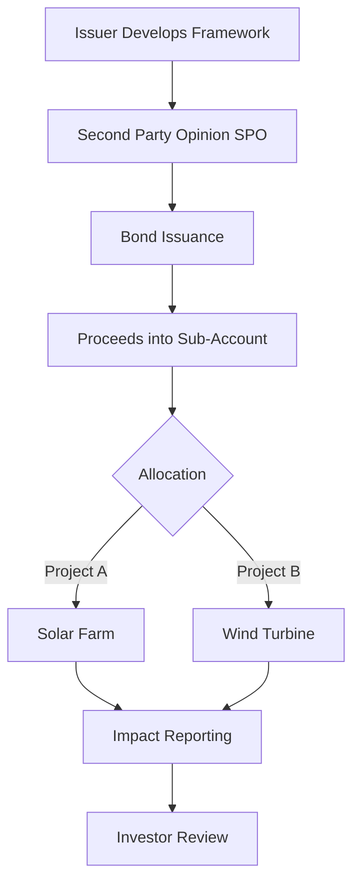

# Green Bond Framework Analysis: A Deep Dive

> **Buy-Side Perspective:**
> As credit analysts, we don't just take a "Green" label at face value. Greenwashing is a real risk that can lead to reputational damage and regulatory fines for issuers, ultimately impacting credit spreads. We must rigorously analyze the *Use of Proceeds*, *Process for Project Evaluation*, *Management of Proceeds*, and *Reporting* to ensure alignment with ICMA Green Bond Principles (GBP). This deep dive provides a framework for that analysis.

## 1. Introduction to Green Bond Frameworks

A Green Bond Framework is the issuer's governance document that sets out how they propose to issue green bonds. It is the primary document for assessing the "greenness" of the bond.

### The Four Pillars of ICMA Green Bond Principles

1.  **Use of Proceeds** (The most critical factor)
2.  **Process for Project Evaluation and Selection**
3.  **Management of Proceeds**
4.  **Reporting**

---

## 2. Pillar 1: Use of Proceeds

This section must be clear, granular, and linked to recognized taxonomies (e.g., EU Taxonomy).

**Analyst Checklist:**
*   [ ] **Granularity:** Are the eligible categories specific? (e.g., "Renewable Energy" vs. "General Corporate Purposes")
*   [ ] **Exclusions:** Does it explicitly exclude fossil fuel projects, nuclear (depending on mandate), or other controversial sectors?
*   [ ] **Look-back Period:** For refinancing, how far back can they go? (Standard is 2-3 years; longer is a red flag).

> **Pro Tip:** "Look for the 'refinancing' clause. If an issuer uses 100% of proceeds to refinance a solar farm built 5 years ago, the *additionality* (positive environmental impact) is zero. Prefer frameworks that allocate fresh capital to new projects."

### Interactive Scenario: The "Clean Coal" Trap

**Scenario:** Utility Co. issues a Green Bond to fund "Efficiency improvements in thermal power plants."
**Question:** Is this aligned with best practices for Green Bonds?

<strong>Click to Reveal Answer</strong>

**Answer: No.**
While efficiency improvements reduce emissions *marginally*, funding fossil fuel infrastructure is generally excluded from recognized Green Bond standards (like the Climate Bonds Initiative). This would likely be flagged as "Greenwashing" by ESG rating agencies and savvy investors.

---

## 3. Pillar 2: Process for Project Evaluation and Selection

Who decides what gets funded?

*   ** Governance:** Is there a dedicated "Green Bond Committee"?
*   ** Expertise:** Does the committee include sustainability experts, or just finance/treasury staff?
*   ** Risk Management:** Are there ESG risk screens applied to the projects themselves (e.g., biodiversity checks for a wind farm)?

---

## 4. Pillar 3: Management of Proceeds

Money is fungible. How do we know the green bond cash doesn't pay the CEO's bonus?

*   **Segregation:** Proceeds should be credited to a sub-account.
*   **Tracking:** The issuer must track the allocation of funds to eligible projects.
*   **Unallocated Proceeds:** How are unspent funds held? (Cash or short-term liquid instruments).

---

## 5. Pillar 4: Reporting

Transparency is the currency of trust.

*   **Allocation Reporting:** How much has been spent? (Annual requirement).
*   **Impact Reporting:** What is the environmental benefit? (e.g., Tons of CO2e avoided, MWh of renewable energy generated).

### Mermaid Diagram: The Green Bond Lifecycle

---

## 6. Case Study: "EcoTrans" Rail Bond

**Context:** EcoTrans, a logistics company, issues a $500M Green Bond.
**Use of Proceeds:** "Acquisition of electric locomotives and upgrading rail signaling infrastructure."
**SPO:** Sustainalytics provides a positive opinion.

**Analyst Decision:**
This is generally a **High Quality** use of proceeds. Rail is low-carbon transport. Signaling upgrades improve efficiency.

**Key Risk:** Check if the electricity powering the locomotives comes from renewable sources or a coal-heavy grid. This is a Scope 2 emission analysis.

---

## 7. Glossary of Key Terms

*   **ICMA GBP:** International Capital Market Association Green Bond Principles.
*   **SPO (Second Party Opinion):** An independent assessment of the Green Bond Framework (e.g., by CICERO, Sustainalytics).
*   **Additionality:** The extent to which a project adds *new* environmental benefits rather than just maintaining status quo.
*   **Greenwashing:** Misleading claims about the environmental benefits of a product, service, or investment.
