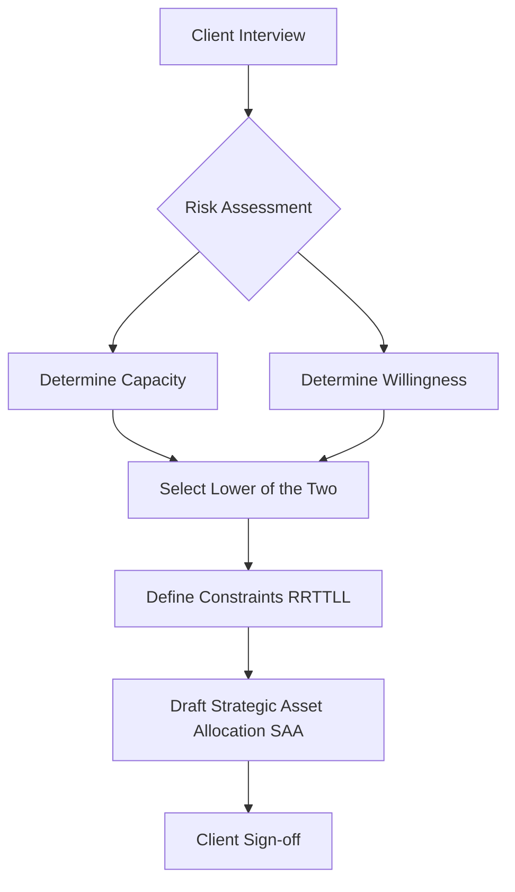

# Private Wealth IPS Construction: The Blueprint of Advice

> **Advisor's Perspective:**
> The Investment Policy Statement (IPS) is not just a compliance document; it is the contract of understanding between you and the client. A well-constructed IPS protects both the client (from unsuitable risks) and the advisor (from liability). It transforms vague goals ("I want to retire comfortably") into actionable constraints and return objectives.

## 1. The Components of an IPS

A robust IPS must contain two distinct sections: **Objectives** and **Constraints**.

### Objectives
1.  **Return Objective:** What % return is needed to meet goals? (Required Return) vs. What return does the client *want*? (Desired Return).
2.  **Risk Objective:** Risk Tolerance = Risk Capacity (Ability) + Risk Aversion (Willingness).

### Constraints (RRTTLL)
*   **R** - Liquidity
*   **R** - Time Horizon
*   **T** - Taxes
*   **T** - Legal & Regulatory
*   **L** - Unique Circumstances

---

## 2. Deep Dive: Risk Capacity vs. Risk Willingness

This is the most common area of failure in wealth management.

| Factor | Description | Example |
| :--- | :--- | :--- |
| **Risk Capacity (Ability)** | Financial ability to withstand loss. Based on wealth, income, time horizon. | A 25-year-old with $1M inheritance has **High Capacity**. |
| **Risk Aversion (Willingness)** | Psychological comfort with volatility. Based on personality. | That same 25-year-old might be terrified of the stock market. **Low Willingness**. |

> **Pro Tip:** "The constraint is always the **lower** of the two. If a client has High Capacity but Low Willingness, you cannot put them in a High Risk portfolio. They will panic sell at the bottom."

---

## 3. Interactive Scenario: The "Over-Eager" Client

**Client Profile:**
*   **Name:** Dr. Smith (Age 60).
*   **Assets:** $2M Portfolio.
*   **Goal:** Retire in 2 years. Needs $100k/year from portfolio.
*   **Statement:** "I want to put 80% of my money in Tech Stocks because my nephew made a fortune in crypto."

**Analysis:**
1.  **Required Return:** $100k / $2M = 5% (plus inflation).
2.  **Risk Capacity:** Low. (Retiring soon, sequence of returns risk).
3.  **Risk Willingness:** High (wants aggressive tech).

**Question:** As the advisor, what do you do?

<strong>Click to Reveal Answer</strong>

**Decision: Restrict Risk.**
You must educate the client. His **Capacity** is the binding constraint. A 50% drop in Tech Stocks right before retirement would ruin his plan. You construct an IPS that targets the 5-6% required return with lower volatility, likely a 60/40 or 50/50 Equity/Fixed Income split, explaining that "capital preservation is now more important than accumulation."

---

## 4. Constraint Analysis: The "RRTTLL" Framework applied

Let's apply RRTTLL to Dr. Smith.

*   **Liquidity:** Needs $100k/year starting in 2 years. Need a cash buffer.
*   **Time Horizon:** Multistage. Stage 1 (2 years to retirement), Stage 2 (20+ years in retirement).
*   **Taxes:** $2M is in a Taxable Account. need tax-efficient funds (ETFs, Munis).
*   **Legal:** None.
*   **Unique:** He supports an elderly mother ($20k/year expense). This increases liquidity needs.

### Mermaid Diagram: The IPS Process

---

## 5. Glossary of Key Terms

*   **Strategic Asset Allocation (SAA):** The target long-term weighting of asset classes (e.g., 60% Stocks / 40% Bonds).
*   **Tactical Asset Allocation (TAA):** Short-term deviations from SAA to take advantage of market dislocations.
*   **Sequence of Returns Risk:** The risk of receiving low or negative returns at the beginning of the withdrawal phase (retirement), significantly depleting longevity of assets.
*   **Capital Preservation:** A strategy focused on protecting the portfolio's principal value.
