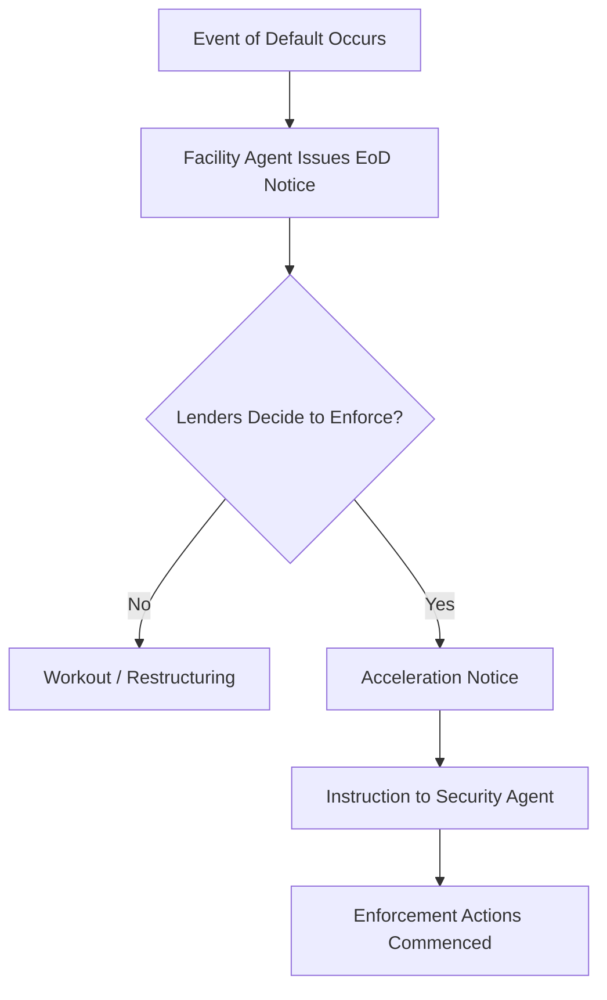
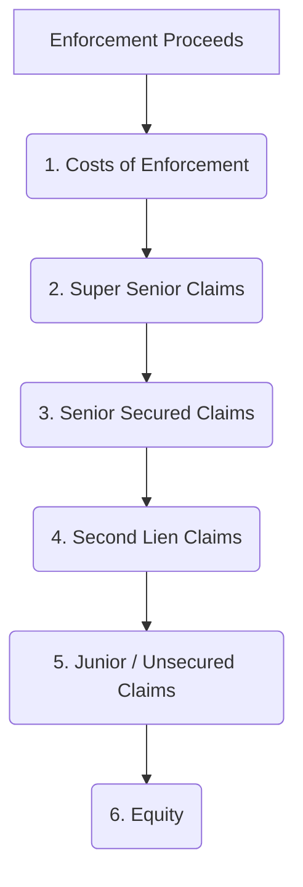

# The Security Enforcement Process in Leveraged Lending

When an Event of Default occurs and lenders decide to exercise their remedies, enforcing the security package is a critical step for secured lenders to recover outstanding amounts. This document outlines the typical process and key considerations.

*(This content will be developed based on information from Sections II.E (Lender Remedies) and II.F (The Security Package) of the "Leveraged Lending: A Comprehensive Legal Knowledge Base" document, as well as general principles of secured lending.)*

## I. Pre-Enforcement Steps

1.  **Declaration of Event of Default:**
    *   The Facility Agent, upon instruction from the Required Lenders (as defined in the credit agreement), will typically issue a formal notice to the borrower declaring that an Event of Default has occurred and is continuing.
2.  **Acceleration Notice:**
    *   Following or concurrently with the EoD notice, an acceleration notice may be issued, making all outstanding obligations immediately due and payable.
3.  **Decision to Enforce:**
    *   The decision to enforce security is a significant one, usually taken by the Instructing Group of lenders (often Majority Lenders or as specified in the Intercreditor Agreement if applicable).
    *   Considerations include the nature of the default, prospects of a consensual workout, value of collateral, and potential costs/risks of enforcement.
4.  **Instruction to Security Agent:**
    *   The Facility Agent (or the relevant instructing group of lenders) will formally instruct the Security Agent (or Security Trustee) to commence enforcement action as per the terms of the security documents and the Intercreditor Agreement.

## II. The Role of the Security Agent

*   The Security Agent holds the security interests on behalf of all secured lenders (within a particular class or across classes if there's a common security agent).
*   Its primary role in enforcement is to act on the instructions of the requisite lenders to realize the value of the secured assets.
*   The Security Agent's powers and duties are defined in the security documents and the Intercreditor Agreement. It typically has indemnities from the lenders for actions taken in good faith.
*   *Source Reference for Agent Roles:* Section I.B, Section II.F

## III. Methods of Enforcement

The specific methods of enforcement will depend on:
*   The type of security interest (e.g., mortgage, charge, pledge, assignment).
*   The nature of the asset (e.g., real estate, shares, bank accounts, receivables, IP).
*   The laws of the jurisdiction where the asset is located or the obligor is incorporated.
*   The terms of the security documents.

Common enforcement methods include:

1.  **Appointment of a Receiver / Administrator (Common in UK/Commonwealth jurisdictions):**
    *   A qualified insolvency practitioner can be appointed over charged assets or the company itself.
    *   A receiver's primary duty is often to the appointing secured creditor to realize assets to repay the secured debt.
    *   An administrator has broader duties to all creditors and the company, but their appointment can be triggered by secured creditors.
2.  **Taking Possession of Assets:**
    *   For tangible assets like property or equipment, the Security Agent may have the right to take physical possession.
3.  **Sale of Secured Assets:**
    *   The Security Agent can sell the charged assets. This is a common method for realizing value.
    *   The sale process usually requires achieving the best price reasonably obtainable in the circumstances. This can involve public auction or private sale.
4.  **Exercising Rights over Shares (Share Pledges/Charges):**
    *   If shares of the borrower or its subsidiaries are pledged, the Security Agent can take control of those shares.
    *   This might involve transferring shares into the name of the Security Agent or its nominee, exercising voting rights, or selling the shares to a new owner (effectively selling the company/subsidiary).
    *   *Source Reference for Share Pledges:* Section II.F
5.  **Directing Payments (for Receivables, Bank Accounts):**
    *   If receivables or bank accounts are charged/assigned, the Security Agent can issue notices to account debtors or banks to redirect payments to the Security Agent.
    *   Account control agreements may facilitate this.
    *   *Source Reference for Bank Account Security:* Section II.F
6.  **Foreclosure (less common in some jurisdictions for corporate lending):**
    *   A legal process where the lender takes title to the secured asset, extinguishing the borrower's equity of redemption.

## IV. Application of Enforcement Proceeds (The Waterfall)

*   Once assets are realized, the cash proceeds are distributed according to a strict order of priority, known as the "waterfall."
*   This waterfall is typically detailed in the Intercreditor Agreement or, if no ICA, in the security documents themselves.
*   The general order is:
    1.  Costs of enforcement (Security Agent fees, legal/advisor costs).
    2.  Super Senior claims (if any, e.g., Super Senior RCF).
    3.  Senior Secured claims (pro rata among them).
    4.  Second Lien claims (if any).
    5.  Other junior secured claims.
    6.  Unsecured claims (if any surplus).
    7.  Equity (very rare in an enforcement scenario).
*   *Source Reference for Waterfall:* Section II.G

## V. Key Considerations and Challenges

*   **Intercreditor Dynamics:** If multiple creditor classes exist (e.g., first lien, second lien), the Intercreditor Agreement is paramount. It will dictate:
    *   Who controls the enforcement process ("instructing group").
    *   Standstill periods for junior creditors (preventing them from enforcing for a certain time).
    *   The precise waterfall for distributing proceeds.
    *   *Source Reference for ICAs:* Section II.F
*   **Valuation:** Determining the value of assets, especially specialized ones or in a distressed market, can be challenging.
*   **Cross-Border Issues:** If assets or obligors are in multiple jurisdictions, enforcement involves navigating different legal systems, perfection requirements, and insolvency regimes.
*   **Costs of Enforcement:** Legal fees, insolvency practitioner fees, and other costs can be substantial and will reduce net proceeds available to lenders.
*   **Borrower Cooperation (or lack thereof):** A cooperative borrower can facilitate a smoother enforcement process (e.g., an orderly sale). A hostile borrower can create obstacles.
*   **Time:** Enforcement can be a lengthy process, especially if litigious or involving complex assets/structures.
*   **Impact on Business Operations:** Enforcement action, particularly the appointment of an administrator or receiver, can significantly disrupt or terminate the borrower's business.

*(This document will be further developed with more specific examples, procedural details, and legal nuances based on the provided text and general market practices.)*
