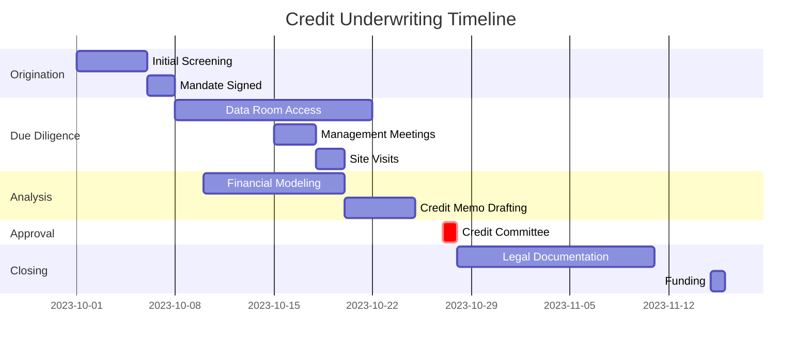

# Module 8: Underwriting New Issuers: Process, Due Diligence, and Approval

## 8.1. The Underwriting Process: From Mandate to Close
Underwriting is the comprehensive evaluation process through which a lender (or investor in debt securities) assesses the creditworthiness of a potential borrower (issuer) and decides whether to extend a loan or invest, and under what terms and conditions. It is a systematic, multi-stage procedure that moves from an initial inquiry or mandate to the final funding of the loan. While the specific steps and terminology can vary by institution and transaction complexity, a typical corporate loan underwriting process involves several key stages:

  
Test Your Knowledge: How does the "Initial Screening" save time?

  

    Initial screening filters out deals that don't fit the bank's risk appetite or policy (e.g., wrong industry, too small) <em>before</em> the analyst spends weeks on due diligence. It's about "failing fast."
  

1.  **Origination, Application, and Initial Screening:**
    *   **Origination:** The opportunity may originate from a relationship manager (RM), investment banker, broker, or directly from a company.
    *   **Application/Initial Information:** The process often begins when a borrower submits a loan application, a term sheet request, or an information package including a business plan, historical financial statements, and details of the financing request (amount, purpose, desired terms).
    *   **Initial Screening:** A loan officer, RM, or underwriting team conducts an initial screening to:
        *   Ensure the request aligns with the lender's basic credit policies, risk appetite, industry focus, and regulatory constraints.
        *   Identify any immediate red flags (e.g., prohibited industry, recent bankruptcy, known integrity issues with management).
        *   Make a preliminary assessment of feasibility and potential interest. This might involve a quick "back-of-the-envelope" sizing or viability check.

2.  **Due Diligence (The Investigative Phase):**
    *   **Purpose:** If the loan passes the initial screen, it moves into the formal due diligence phase. This is an in-depth investigation into all aspects of the borrower's business, financial condition, management, industry, and ability to repay the proposed debt. The goal is to verify information provided by the borrower, uncover hidden risks, and gather all necessary data for a comprehensive credit analysis.
    *   **Analyst's Role:** The credit analyst plays a central role in this stage, gathering, organizing, and analyzing a wide range of information (see section 8.2 for the checklist). This involves:
        *   Reviewing financial statements, projections, and supporting documentation.
        *   Analyzing industry data and competitive positioning.
        *   Researching the management team and corporate structure.
        *   Often involves management meetings, site visits (if applicable), and calls with the borrower to ask clarifying questions.
        *   Coordinating with third-party advisors if their reports are part of the diligence (e.g., QoE accountants, appraisers, environmental consultants).
    *   **Key Questions to Probe:** What are the key drivers of revenue and profitability? How sustainable are historical earnings? What is the quality of assets? Are projections achievable and based on reasonable assumptions? What are the major business and financial risks?

3.  **Credit Analysis and Memorandum (Credit Memo) Preparation:**
    *   **Purpose:** The analyst synthesizes the voluminous findings from due diligence into a comprehensive, objective, and persuasive credit memorandum (as detailed in Module 5 and 6).
    *   **Process:**
        *   Building or updating a detailed 3-statement financial model (Module 2).
        *   Calculating and analyzing key historical and projected financial ratios.
        *   Performing sensitivity and scenario analysis to test the robustness of projections.
        *   Assessing all key risks (business, financial, industry, management, structural) and identifying potential mitigants.
        *   Developing a clear repayment thesis (primary, secondary, tertiary sources).
        *   Formulating a well-reasoned credit recommendation (approve, decline, or approve with specific conditions/modifications).
        *   Proposing appropriate loan structure, terms, and covenants.

4.  **Credit Committee Approval (The Decision Point):**
    *   **Purpose:** The credit memo and supporting due diligence package are presented to a credit committee (or designated individuals with credit authority) for a final decision. The committee typically comprises senior lenders, credit risk managers, and sometimes representatives from other relevant departments.
    *   **Dynamics:** The committee's role is to provide an independent and objective challenge to the loan proposal. They will:
        *   Rigorously question the analyst and relationship manager on their analysis, assumptions, and conclusions.
        *   Focus on key risks, the strength of mitigants, the reasonableness of financial projections, and compliance with credit policy.
        *   Debate the merits of the transaction and its alignment with the institution's risk appetite.
    *   **Analyst's Role in Presentation:** Clearly and confidently present the credit narrative, anticipate committee questions, defend the analysis with facts and data, and be prepared to discuss alternative scenarios or sensitivities.
    *   **Potential Outcomes:** Approve as proposed; Approve with modifications (e.g., different amount, pricing, covenants, collateral); Decline; or Defer/Hold for more information or further diligence.

5.  **Documentation and Legal Review:**
    *   **Purpose:** If the loan is approved by the credit committee, the next step is to translate the approved terms into legally binding documents.
    *   **Process:**
        *   Legal counsel (internal or external) drafts the formal credit agreement, security agreements (if secured), promissory notes, guarantees, and any other necessary legal documents based on the approved term sheet and credit memo.
        *   Both the lender and borrower (and their respective counsels) review and negotiate the final terms and language of these documents. This can be an iterative process.
        *   The credit analyst may be involved in ensuring the legal documents accurately reflect the approved credit terms and that covenants are correctly defined and testable.

6.  **Closing and Funding (The Final Step):**
    *   **Purpose:** To finalize all legalities and disburse the loan proceeds.
    *   **Process:**
        *   All conditions precedent (CPs) to closing must be met and documented (e.g., delivery of all signed documents, perfection of security interests, payment of fees, no material adverse change).
        *   Once all CPs are satisfied, the loan is officially "closed."
        *   Funds are disbursed to the borrower according to the agreed-upon terms.
        *   Post-closing, the loan moves into the monitoring phase (Module 10).

## 8.2. The Due Diligence Checklist: A Comprehensive Investigation
Thorough and diligent investigation is the bedrock of sound underwriting. It is the process of independently verifying the information provided by the borrower and uncovering any potential risks or material facts that may not be immediately apparent. A comprehensive due diligence checklist is an essential tool for ensuring that all critical areas are systematically investigated. While the depth and breadth will vary by transaction size and complexity, the checklist is typically organized into key categories:

*   **A. Financial Due Diligence:**
    *   **Historical Financial Statements (Audited & Interim):** Review at least 3-5 years of audited annual statements and the most recent interim statements. Analyze trends, consistency, and any qualifications or restatements.
    *   **Quality of Earnings (QoE) Analysis:** If available (often commissioned for M&A or larger deals), a QoE report from an accounting firm can provide deep insights into the sustainability and accuracy of reported EBITDA and identify non-recurring items, accounting policy choices, and working capital trends. If no formal QoE, the analyst must perform their own assessment.
        *   *Key Focus:* Non-recurring revenue/expenses, pro forma adjustments, accounting policies (especially revenue recognition, inventory valuation, expense capitalization), related-party transactions.
    *   **Financial Projections & Underlying Assumptions:** Critically evaluate the borrower's financial forecasts. Are assumptions for revenue growth, margins, CapEx, and working capital reasonable, well-supported, and consistent with historical performance and industry outlook?
    *   **Revenue Analysis:** Breakdown by product/service, customer, geography. Assess customer concentration, contract terms, backlog, sales pipeline, and pricing power. *Probe for customer profitability.*
    *   **Cost Structure Analysis:** COGS (material, labor, overhead) and operating expenses (SG&A, R&D). Fixed vs. variable costs, operating leverage, and efficiency trends.
    *   **Cash Flow Analysis:** Scrutinize historical cash flow generation (CFO, CFI, CFF), the cash conversion cycle, capital expenditure patterns (maintenance vs. growth CapEx), and overall liquidity management.
    *   **Balance Sheet Analysis:** Asset quality (A/R aging, inventory obsolescence), debt structure, off-balance sheet liabilities, contingent liabilities, equity adequacy.
    *   **Tax Compliance:** Review tax returns (if appropriate for private companies) and ensure the company is in good standing with all tax authorities. Understand effective tax rate and any significant deferred tax assets/liabilities.
    *   **Internal Controls:** Assess the adequacy of the company's financial reporting systems and internal controls, especially for private companies.

*   **B. Business and Commercial Due Diligence:**
    *   **Market and Industry Analysis:** Assess the size, growth rate, cyclicality, and key trends of the borrower's industry. Understand the regulatory environment and technological landscape.
    *   **Competitive Positioning (Porter's Five Forces):** Analyze the borrower's market share, competitive advantages (e.g., brand, technology, cost leadership), and the strengths/weaknesses of its key competitors. How sustainable is its position?
    *   **Products and Services:** Understand the value proposition, product lifecycle, R&D pipeline, and any intellectual property (patents, trademarks, copyrights).
    *   **Management Team & Organizational Structure:** Assess the experience, track record, integrity, depth, and succession planning of the senior management team. Understand ownership structure and any potential conflicts of interest.
    *   **Suppliers & Supply Chain:** Evaluate the stability and reliability of the supply chain. Assess concentration risk with key suppliers, alternative sources, and vulnerability to disruptions or price volatility.
    *   **Customers:** Beyond concentration, understand customer relationships, satisfaction levels, and switching costs.
    *   **Sales & Marketing Strategy:** How does the company reach its customers? Effectiveness of its sales channels and marketing efforts.
    *   **Environmental, Social, and Governance (ESG) Factors:** Assess relevant ESG risks and opportunities (e.g., environmental impact, labor practices, governance standards) that could affect creditworthiness.

*   **C. Legal and Regulatory Due Diligence:**
    *   **Corporate Structure & Good Standing:** Verify the company's legal organization, articles of incorporation, bylaws, and ensure it is in good standing in relevant jurisdictions.
    *   **Material Contracts Review:** Examine key contracts with major customers, suppliers, licensors, lessors, and employees (e.g., employment agreements with key executives). Look for:
        *   Change of control clauses.
        *   Assignment restrictions.
        *   Restrictive covenants that might conflict with new loan terms.
        *   Termination rights.
    *   **Litigation, Claims, and Contingencies:** Investigate any ongoing, pending, or threatened legal disputes, regulatory actions, or unasserted claims. Assess potential financial or reputational risk.
    *   **Regulatory Compliance:** Ensure the company holds all necessary permits, licenses, and is in compliance with all relevant industry-specific, environmental, labor, and safety regulations.
    *   **Security Interests & Liens:** Conduct searches to identify any existing liens or security interests on the company's assets.
    *   **Intellectual Property (IP) Ownership & Protection:** Verify ownership and validity of key patents, trademarks, and copyrights.
    *   **Insurance Coverage:** Review adequacy of insurance policies (property, liability, D&O, etc.).

## 8.3. Key Underwriting Considerations: The Five C's of Credit (and more)
Beyond the process and checklist, successful underwriting hinges on a holistic assessment of several critical factors. A traditional framework, still highly relevant, is the **"Five C's of Credit"**:

1.  **Character:**
    *   **Focus:** The borrower's integrity, reputation, and willingness to repay debt. This is often considered the most important 'C'.
    *   **Assessment:** Track record of meeting past obligations, management's experience and credibility, references, history of business practices. Are they transparent and cooperative during due diligence?
2.  **Capacity (or Cash Flow):**
    *   **Focus:** The borrower's ability to generate sufficient cash flow to service the proposed debt (both principal and interest) from its operations. This is the primary source of repayment.
    *   **Assessment:** Historical and projected financial performance (EBITDA, Free Cash Flow), debt service coverage ratios (DSCR, FCCR), quality and stability of earnings, scenario analysis showing resilience to stress.
3.  **Capital (or Net Worth):**
    *   **Focus:** The borrower's financial strength and cushion against losses; the amount of equity or net worth invested in the business. A strong capital base indicates the owners have significant "skin in the game."
    *   **Assessment:** Leverage ratios (Debt/Equity, Debt/Capital), tangible net worth, quality of assets, sponsor commitment in LBOs (equity contribution).
4.  **Collateral (or Security):**
    *   **Focus:** Assets pledged by the borrower to secure the loan, providing a secondary source of repayment if cash flow is insufficient.
    *   **Assessment:** Value, quality, liquidity, and marketability of the collateral (e.g., accounts receivable, inventory, equipment, real estate). Loan-to-Value (LTV) ratios, independent appraisals, perfection of security interests.
5.  **Conditions:**
    *   **Focus:** The terms of the loan agreement itself, as well as the prevailing economic and industry conditions.
    *   **Assessment:**
        *   *Loan Structure:* Amount, purpose, tenor, interest rate, repayment schedule, covenants, fees. Are these appropriate for the borrower's risk profile and purpose?
        *   *Economic Climate:* Current and projected state of the economy (GDP growth, inflation, interest rates).
        *   *Industry Conditions:* Outlook for the borrower's specific industry, competitive pressures, regulatory landscape.

**Modern Additions/Emphasis:**
*   **Confidence:** Confidence in the information provided, in management's ability, and in the overall business plan.
*   **Compliance:** Adherence to all regulatory requirements and internal credit policies.
*   **Covenants:** The specific contractual terms designed to protect the lender and provide early warning signals.

## 8.4. The Credit Approval Process: Decision and Documentation
The credit approval process formalizes the lending decision within a financial institution. After the analyst completes their due diligence and prepares the comprehensive credit memorandum, the loan package is submitted to the credit committee (or delegated lending authority) for a final decision.

*   **The Credit Package:** Typically includes the credit memorandum, historical and projected financial statements, relevant due diligence reports (e.g., appraisals, environmental reports, QoE findings), and any other supporting documentation.
*   **Credit Committee Role:** As discussed earlier, the committee provides an independent, objective review and challenge function. They are responsible for ensuring the proposed loan aligns with the institution's risk appetite, credit policies, and profitability targets.
*   **Preparing for Committee:** The analyst and relationship manager must be thoroughly prepared to:
    *   Present the transaction clearly and concisely.
    *   Articulate the key risks and how they are mitigated.
    *   Defend the assumptions in the financial projections.
    *   Answer detailed questions on any aspect of the borrower, industry, or loan structure.
*   **Decision and Documentation:** The committee's decision (approve, decline, approve with changes) is formally documented, often with specific conditions or required modifications. If approved, this decision forms the basis for the legal team to draft or finalize the loan documents. The approved terms, including pricing, covenants, and collateral, must be accurately reflected in these legal agreements.

Successful underwriting requires a blend of analytical rigor, sound judgment, healthy skepticism, and effective communication. It is both a science (financial analysis, modeling) and an art (assessing character, management, and qualitative factors).
=======
=======
# Module 8: Underwriting New Issuers

## 8.1. The Underwriting Process from Mandate to Close
Underwriting is the comprehensive process through which a lender evaluates the creditworthiness of a potential borrower and decides whether to extend a loan. It is a systematic procedure that moves from an initial inquiry to the final funding of the loan. While the specific steps can vary, a typical corporate loan underwriting process involves several key stages:
1.  **Application and Initial Screening:** The process begins when a borrower submits a loan application, along with preliminary documents like a business plan and historical financial statements. A loan officer or relationship manager conducts an initial screening to ensure the request aligns with the lender's basic policies and to identify any immediate red flags.
2.  **Due Diligence:** If the loan passes the initial screen, it moves into the formal due diligence phase. This is an in-depth investigation into all aspects of the borrower's business, financials, and industry. The credit analyst plays a central role in this stage, gathering and analyzing a wide range of information.
3.  **Credit Analysis and Memo Preparation:** The analyst synthesizes the findings from due diligence into a comprehensive credit memorandum. This involves building a financial model, calculating key ratios, assessing risks and mitigants, and ultimately forming a recommendation.
4.  **Credit Committee Approval:** The credit memo and supporting documents are presented to a credit committee, which is composed of senior lenders and risk managers. The committee reviews the analysis, challenges the assumptions, and makes the final decision to approve, decline, or modify the loan request.
5.  **Documentation and Legal Review:** If the loan is approved, legal counsel drafts the formal credit agreement and all related security documents. Both the lender and borrower review and negotiate the final terms.
6.  **Closing and Funding:** Once all documents are signed and all conditions precedent are met, the loan is officially "closed," and the funds are disbursed to the borrower.

## 8.2. The Due Diligence Checklist
Thorough due diligence is the foundation of sound underwriting. It is the process of verifying the information provided by the borrower and uncovering any potential risks that may not be immediately apparent. A comprehensive due diligence checklist is an essential tool for ensuring that all critical areas are investigated. The checklist is typically organized into three main categories:

*   **Financial Due Diligence:**
    *   Historical Financial Statements: Review at least three to five years of audited income statements, balance sheets, and cash flow statements to assess past performance and trends.
    *   Quality of Earnings (QoE): Analyze the sustainability and accuracy of reported earnings. Identify any non-recurring items, accounting changes, or aggressive revenue recognition practices.
    *   Revenue and Customer Concentration: Examine revenue sources and assess the risk of dependence on a small number of customers.
    *   Cash Flow Analysis: Scrutinize historical cash flow generation, the cash conversion cycle, and overall liquidity.
    *   Financial Projections: Evaluate the reasonableness of the borrower's financial forecasts and the assumptions that underpin them.
    *   Tax Compliance: Review tax returns and ensure the company is in good standing with all tax authorities.

*   **Business and Commercial Due Diligence:**
    *   Market and Industry Analysis: Assess the size, growth rate, and key trends of the borrower's industry. Use frameworks like Porter's Five Forces to understand the competitive dynamics.
    *   Competitive Positioning: Analyze the borrower's market share, competitive advantages, and the strengths and weaknesses of its key competitors.
    *   Supplier and Supply Chain Analysis: Evaluate the stability of the supply chain and assess any concentration risk with key suppliers.
    *   Management Team: Assess the experience, track record, and integrity of the senior management team.

*   **Legal Due Diligence:**
    *   Corporate Structure: Verify the company's legal standing, articles of incorporation, and bylaws.
    *   Contracts: Review material contracts with customers, suppliers, and employees to understand key obligations and potential liabilities.
    *   Litigation: Investigate any ongoing or past legal disputes and regulatory actions to assess potential financial or reputational risk.
    *   Regulatory and Environmental Compliance: Ensure the company holds all necessary permits and licenses and is in compliance with all relevant regulations, including environmental laws.
    *   Intellectual Property: Evaluate the ownership and validity of key patents, trademarks, and copyrights.

## 8.3. The Credit Approval Process
The credit approval process formalizes the lending decision within a financial institution. After the analyst completes their due diligence and prepares the credit memorandum, the loan package is submitted to the credit committee for a final decision.

The role of the credit committee is to provide an independent and objective challenge to the loan proposal. They are not involved in the day-to-day relationship with the borrower and can therefore assess the credit risk without bias. The committee members will rigorously question the analyst and relationship manager on their analysis, focusing on the key risks, the strength of the mitigants, and the reasonableness of the financial projections.

A successful presentation to the credit committee requires the analyst to have a deep command of the facts and to present a clear, confident, and convincing credit narrative. The final decision of the committee—whether to approve, decline, or approve with modified terms (e.g., requiring a higher interest rate, more collateral, or tighter covenants)—is documented, and this decision forms the basis for the subsequent legal documentation and closing of the loan.
