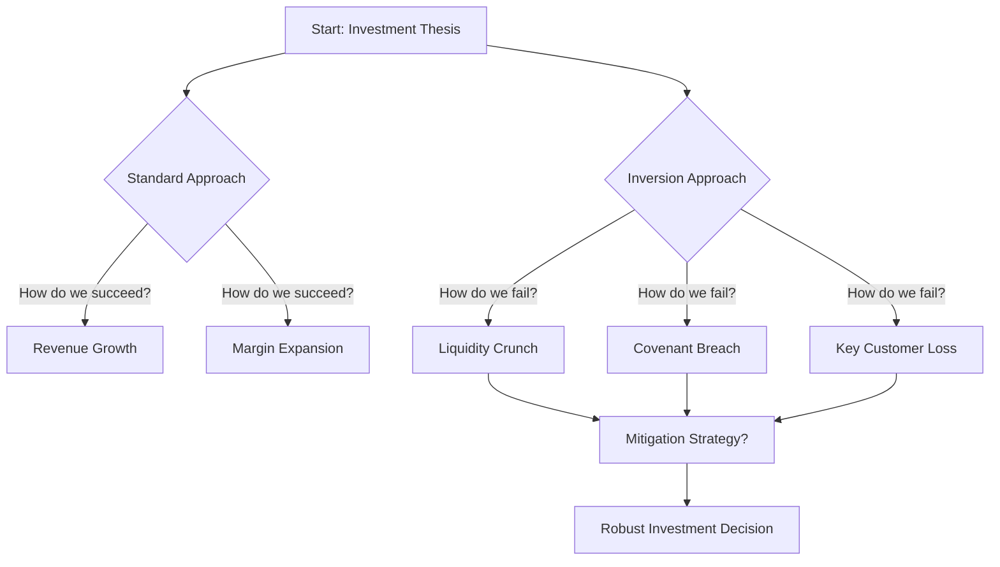
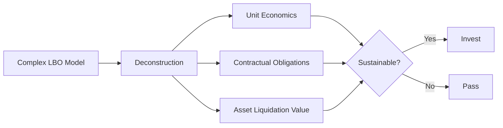

# Mental Models for Credit Analysts

> **Buy-Side Perspective:** In high-stakes credit investing, your biggest risk isn't just bad data—it's bad thinking. Mental models are the "operating system" of your brain. They allow you to cut through noise, identify risks that others miss, and make high-conviction decisions faster. We don't just memorize definitions; we build a lattice of models to simulate outcomes before capital is deployed.

## 1. Inversion: The Art of Thinking Backwards

"Invert, always invert," said mathematician Carl Jacobi. As analysts, we are trained to look for upside. Inversion forces us to look for failure.

Instead of asking, **"What must happen for this deal to work?"** ask **"What is the most likely way this company defaults?"**

### The Process of Inversion

> **Pro Tip:** Before every Investment Committee meeting, perform a "Pre-Mortem." Assume the deal has already defaulted 12 months from now. Write the memo explaining *why* it happened. This exercise uncovers risks your standard diligence missed.

### Knowledge Check: Applying Inversion

<strong>Scenario: Evaluating a Retailer</strong>

You are evaluating a brick-and-mortar retailer proposing a turnaround strategy based on massive store renovations to drive foot traffic.

**Standard Question:** "How much will sales uplift from the renovations?"

**Inversion Question:** ___________________________?

**Answer:**
**"What happens to liquidity if sales remain flat despite the capex spend?"**

*Reasoning:* By inverting, you move from hoping for revenue growth (variable) to analyzing the cash burn impact of the renovations (fixed). If the company runs out of cash before the uplift works, the equity is zero.

## 2. First Principles Thinking

Reasoning by analogy ("We should invest in X because it's like Y") is dangerous in credit. First Principles thinking involves breaking a problem down to its fundamental truths and building up from there.

### Deconstructing a Leveraged Buyout (LBO)

Don't just accept the sponsor's model. Deconstruct it.

1.  **Fundamental Truth 1:** Cash flow pays debt.
2.  **Fundamental Truth 2:** Assets provide recovery in default.
3.  **Fundamental Truth 3:** Interest rates dictate the cost of time.

If a deal relies on "multiple expansion" (selling at a higher price than bought) rather than debt paydown via cash flow, it violates the First Principle of credit safety.

## 3. The Map is Not the Territory

A financial model (The Map) is a simplification of reality (The Territory). Never confuse the two.

*   **The Map:** Excel projections showing smooth 5% EBITDA growth.
*   **The Territory:** A competitor launching a price war, a factory fire, or a regulatory change.

> **Pro Tip:** "The model is always wrong; the question is by how much." Stress test your variables by 20-30%. If the model breaks with a 10% revenue miss, the "Map" is too fragile for the "Territory."

### Knowledge Check: Model vs. Reality

<strong>Scenario: The Perfect Hedge</strong>

Your model shows that the company is 100% hedged against interest rate risk using swaps. The "Map" says interest expense is fixed.

**What reality (Territory) might the map be missing?**

**Answer:**
**Counterparty Risk.**

*Reasoning:* The map assumes the bank on the other side of the swap will always pay. In a systemic crisis (Territory), the counterparty might fail, leaving your company exposed to floating rates exactly when they can least afford it.

## 4. Circle of Competence

Define what you know and, more importantly, what you don't know. Stick to your circle.

*   **Inside the Circle:** Industries where you understand the unit economics, the players, and the history.
*   **Outside the Circle:** Speculative tech, unproven business models, or jurisdictions with weak rule of law.

In Credit, we don't need to be heroes. We need to get paid back. Straying outside your circle increases the probability of "unknown unknowns" killing your principal.

---

**Next Steps:** Use these models in your next credit memo. Explicitly have a section called "Inversion Risks" or "Pre-Mortem Analysis."
