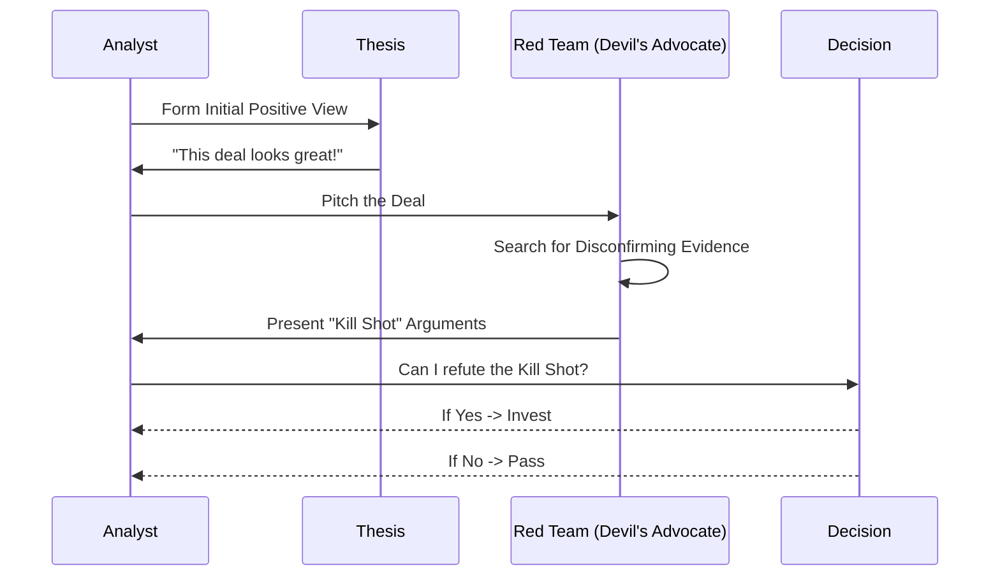
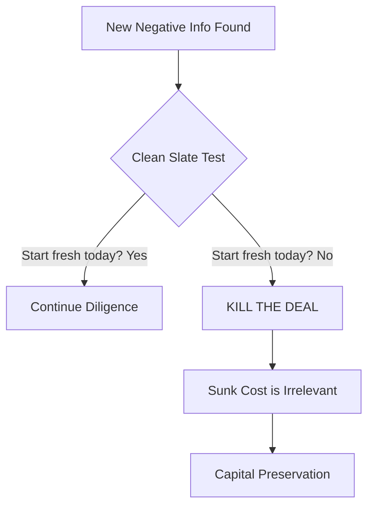

# Bias Mitigation Strategies

> **Buy-Side Perspective:** In credit markets, the market is usually "efficientish." Opportunities exist because human beings—including other smart analysts—are irrational. Cognitive biases cause mispricing. If you can identify and mitigate your own biases, you gain a massive competitive advantage. If you can't, you become the "patsy" at the poker table.

## 1. Confirmation Bias: The Echo Chamber

Confirmation bias is the tendency to search for, interpret, and recall information that confirms your pre-existing beliefs.

*   **The Trap:** You like a company's product. You read the bullish sell-side reports. You ignore the one negative review from a former employee.
*   **The Fix:** **The "Red Team" Exercise.**

Assign a colleague (or yourself) to specifically advocate for *rejecting* the deal. Their job is to destroy the investment thesis.

### Bias Mitigation Loop

### Knowledge Check: Confirmation Bias

<strong>Scenario: The Turnaround Story</strong>

You are analyzing a distressed company. Management claims "EBITDA will double next year due to cost cuts." You find three expert network calls that support this view. You find one call that says "the cost cuts will destroy product quality."

**What is the Confirmation Bias error here?**

**Answer:**
**Overweighting the majority view because it aligns with the optimistic thesis.**

*Fix:* You must assume the negative call is correct and model the financial impact. If the cost cuts destroy quality, revenue will drop. Does the deal still work if revenue drops 10%?

## 2. Anchoring Bias: The Price Tag Problem

Anchoring occurs when we rely too heavily on the first piece of information we receive.

*   **The Trap:** The Sponsor says "We bought this for 10.0x EBITDA, so buying the debt at 5.0x is a steal!"
*   **The Reality:** The 10.0x entry price is irrelevant to today's value. The company might now be worth 4.0x.
*   **The Fix:** **Zero-Based Valuation.**

Build your valuation model *before* looking at the trading price or the sponsor's entry multiple. Determine the value of the assets in a liquidation or independent sale. Only then compare it to the ask.

> **Pro Tip:** When looking at a term sheet, cover up the "Market Flex" or "Price Talk" column. Decide what spread *you* require for the risk first. Then look. If your number is L+500 and the market is L+350, it's a pass—no matter what the "Anchor" says.

## 3. Commitment and Consistency (Sunk Cost Fallacy)

Once we publicly commit to a view, we struggle to change it.

*   **The Trap:** You've spent two weeks modeling a deal. You've told your PM it looks promising. On day 14, you find a legal lawsuit risk.
*   **The Bias:** "I've already done so much work, the lawsuit is probably minor. I don't want to look like I wasted two weeks."
*   **The Fix:** **The "Clean Slate" Test.**

Ask yourself: "If I started looking at this deal *today* with this new information (the lawsuit), would I still bother doing the work?"

## 4. Availability Heuristic

We judge the probability of an event by how easily examples come to mind.

*   **The Trap:** "Retail is dead because I see empty malls." Or "SaaS is safe because Salesforce did well."
*   **The Fix:** **Base Rate Neglect Check.**

Look at the statistical base rates. What is the historical default rate for B-rated retailers? What is the churn rate for small-cap SaaS? Don't rely on recent headlines (recency bias) or vivid anecdotes.

---

**Summary:** Your brain is designed for survival on the savanna, not for high-yield bond trading. You must actively debug your own thinking using these tools.
