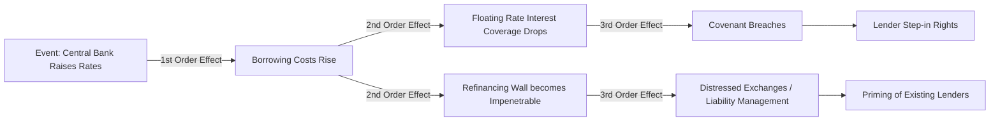

# Second-Order Thinking

> **Buy-Side Perspective:** "First-level thinking is simplistic and superficial, and just about everyone can do it... Second-level thinking is deep, complex, and convoluted." — Howard Marks. In credit, first-level thinkers get paid the coupon. Second-level thinkers avoid the default that happens three steps down the chain.

## The Concept: "And Then What?"

Every action has a consequence, and every consequence has a subsequent consequence.

*   **First-Order Thinking:** "Problem A exists. Solution B solves it." (Immediate gratification).
*   **Second-Order Thinking:** "If we implement Solution B, what new problems are created? How does the system react?"

### Visualizing the Ripple Effect

## Practical Application: Chesterton's Fence

G.K. Chesterton famously proposed: "Do not remove a fence until you know why it was put there in the first place."

In financial restructuring:
*   **The Fence:** A strict restrictive covenant in a credit agreement (e.g., "No additional debt").
*   **First-Order Thought:** "We need liquidity. Let's ask lenders to waive this covenant."
*   **Second-Order Consequence:** If you waive the covenant without getting something in return (like a tighter leash on management), the sponsor might layer in *more* debt later, diluting your claim.

> **Pro Tip:** When a borrower asks for a waiver or amendment, never ask "Why do they need it?" (First Order). Ask "What does this allow them to do *next* that they can't do now?" (Second Order).

## Knowledge Check: The "Synergy" Trap

<strong>Scenario: The Mega-Merger</strong>

Two large healthcare companies merge. Management claims $500M in "Synergies" by firing overlapping sales staff.
*   **First-Order View:** Expenses drop by $500M -> EBITDA increases -> Deleveraging.

**What is the Second-Order Risk?**

**Answer:**
**Revenue Attrition and Culture Clash.**

*Reasoning:* Firing sales staff often disrupts customer relationships (Revenue drops). Merging two massive cultures distracts management from operations.
*Result:* EBITDA might actually *fall* because the revenue loss outweighs the cost savings. The company ends up with more debt (to fund the merger) and less earnings.

## Mapping the System

Complex systems (like the economy or a company) are non-linear.

### Case Study: The Auto Supplier
A car manufacturer demands a 10% price cut from its suppliers.
1.  **Direct Effect:** Supplier revenue drops.
2.  **Second-Order:** Supplier cuts R&D to save cash.
3.  **Third-Order:** Supplier falls behind on EV technology.
4.  **Fourth-Order:** Car manufacturer fires the supplier 3 years later because they don't have an EV product.

As a credit analyst lending to the supplier, you might survive step 1. You will lose your principal at step 4.

## How to Practice
1.  **Ask "And then what?"** at least three times for every major assumption in your model.
2.  **Think in Timelines:** First order happens now (0-6 months). Second order happens later (6-18 months). Third order happens eventually (18+ months). Most loans have a 5-7 year maturity—you *must* care about the third order.
