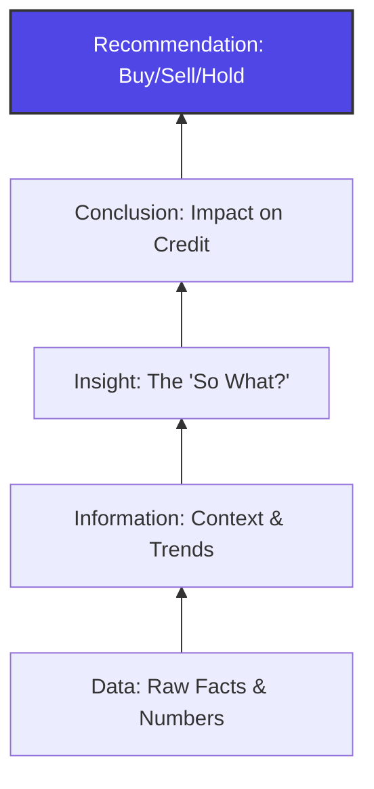

# The "So What?" Framework

> **Buy-Side Perspective:** Portfolio Managers (PMs) are drowning in data. They don't need you to tell them "Revenue is up 10%." They can read the press release. They pay you to tell them *what that means for the money*. If you end a presentation with a fact, you have failed. You must end with a judgment.

## From Data to Decision

The job of an analyst is to transmute raw data into actionable investment decisions. This requires climbing the "Insight Pyramid."

### 1. Data (The What)
*   *Example:* "Company A's Accounts Receivable (AR) days increased from 45 to 60."
*   *Status:* Commodity. AI can do this.

### 2. Insight (The So What?)
*   *Analysis:* "AR days are up because the company is stuffing the channel to meet quarterly revenue targets, or customers are refusing to pay due to quality issues."
*   *Status:* Value Add.

### 3. Conclusion (The Now What?)
*   *Judgment:* "Quality issues are leading to a liquidity squeeze. Working capital is now a use of cash, not a source. The revolver will be drawn next quarter."
*   *Status:* High Value.

### 4. Recommendation (The Action)
*   *Decision:* "Sell the 2028 bonds. The liquidity crunch will breach the leverage covenant by Q3."
*   *Status:* Essential.

---

## The Iterative "So What?" Exercise

To find the insight, keep asking "So What?" until you hit the money.

> **Pro Tip:** When writing a credit memo header, never use a descriptive title like "Financial Update." Use an active title like "Deteriorating Working Capital Threatens Liquidity."

### Interactive Example: The "So What" Chain

**Fact:** Capex spending is 20% below budget.

1.  **So What?** Free Cash Flow (FCF) is artificially higher this quarter.
2.  **So What?** The company is deferring maintenance on its aging machinery.
3.  **So What?** Operational efficiency will degrade, and a large "catch-up" spend will be required next year, crushing FCF just when debt maturity hits.
4.  **Recommendation:** The current FCF yield is a trap. Avoid.

## Knowledge Check: Constructing the Narrative

<strong>Scenario: Margin Expansion</strong>

**Data:** Gross Margin improved from 30% to 35%.
**Context:** Competitors are at 28%. Raw material costs have been flat.

**Construct the "So What?"**
1. Why did margins go up? (Did they raise prices? Cut quality?)
2. Is it sustainable?
3. What does it mean for our bonds?

**Answer:**
*   **Insight:** If costs are flat and competitors are lower, the company likely has pricing power OR they are underinvesting in the product.
*   **Deep Dive:** If we find they cut R&D, the margin boost is temporary.
*   **Conclusion:** This is "bad quality" earnings growth.

## Structuring the Pitch

When presenting to an Investment Committee (IC), invert the pyramid. Start with the Recommendation.

1.  **The Headline:** "We should pass on Deal X."
2.  **The Why (The So What):** "Despite headline growth, unit economics are deteriorating."
3.  **The Evidence (The Data):** "Churn is up 5% and CAC is up 20%."

Don't bury the lead.
